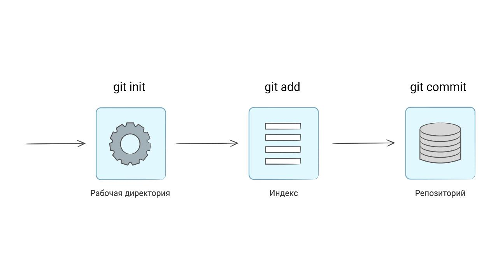

# Инструкция для работы с Git и удалёнными репозиториями

# Что такое Git?

**_Git_** - это одна из реализаций распределённых систем контроля версий, имеющая как и локальные, так и удалённые репозитории. Являеслтся самой популярной реализацией систем контроля версий в мире.

С помощью Git-a вы можете откатить свой проект до более старой версии, сравнивать, анализировать или сливать свои изменения в репозиторий.

Репозиторием называют хранилище вашего кода и историю его изменений. Git работает локально и все ваши репозитории хранятся в определенных папках на жестком диске.

## Подготовка репозитория

Для создание репозитория необходимо выполнить команду *git init*  в папке с репозиторием и у Вас создаться репозиторий (появится скрытая папка .git)

## Создание коммитов

### Git add
Для добавления измений в коммит используется команда *git add*. Чтобы использовать команду *git add* напишите *git add <имя файла>*

### Просмотр состояния репозитория
Для того, чтобы посмотреть состояние репозитория используется команда *git status*. Для этого необходимо в папке с репозиторием написать *git status*, и Вы увидите были ли измения в файлах, или их не было.

### Создание коммитов
Для того, чтобы создать коммит(сохранение) необходимо выполнить команду *git commit*. Выполняется она так: *git commit -m "<сообщение к коммиту>*. Все файлы для коммита должны быть ***ДОБАВЛЕНЫ*** и сообщение к коммиту писать ***ОБЯЗАТЕЛЬНО***.

Если вы выполнили коммит и сразу обнаружили ошибку - вы можете его отменить вызвав команду git reset .

На практике часто используются 2 опции: это -m, которая позволяет указать commit message без обращения к редактору и опция --amend, которая изменения, которые подготовленны к коммиту вносит в предыдущий коммит. Также, эту опцию можно применять, например, если вы ошиблись в commit message и хотите его отредактировать. Стоит помнить, что применение этой команды изменит sha предыдущего коммита, поэтому, если вы уже отправили коммит в репозиторий, применять ее стоит, если только вы понимаете, что для отправки нового комита вам придется переписать историю на удаленном сервере, что может привести к ряду проблем, если этот репозиторий кем-то или чем-то используется.

## Перемещение между сохранениями
Для того, чтобы перемещаться между коммитами, используется команда *git checkout*. Используется она в папке с пепозиторием следующим образом: *git checkout <номер коммита>*

Если вы выполнили коммит и сразу обнаружили ошибку - вы можете его отменить вызвав команду - *git reset*

На практике часто используются 2 опции: это **-m**, которая позволяет указать commit message без обращения к редактору и опция **--amend**, которая изменения, которые подготовленны к коммиту вносит в предыдущий коммит. Также, эту опцию можно применять, например, если вы ошиблись в commit message и хотите его отредактировать. 

Стоит помнить, что применение этой команды изменит sha предыдущего коммита, поэтому, если вы уже отправили коммит в репозиторий, применять ее стоит, если только вы понимаете, что для отправки нового комита вам придется переписать историю на удаленном сервере, что может привести к ряду проблем, если этот репозиторий кем-то или чем-то используется.

## Журнал изменений
Для того, чтобы посмтреть все сделанные изменения в репозитории, используется команда *git log*. Для этого достаточно выполнить команду *git log* в папке с репозиторием

# Ветки в Git

* ## Создание ветки

>**_Ветка_** - это набор commit (кружок), которые идут друг за другом. У ветки есть название, основную ветку чаще всего называют *master* . Если говорить простыми словами, то ветка *master* - это наш проект.

Другие ветки - это отдельное место для реализации нового функционала или исправление багов (ошибок) нашего проекта. То есть, с отдельной веткой вы делаете что угодно, а затем сливаете эти изменения в основную ветку master.

>>***Не рекомендуют создавать commit напрямую в master . Лучше для этого заводить новую ветку и все изменения писать там.***

Для того, чтобы создать ветку, используется команда *git branch*. Делается это следующим образом в папке с репозиторием: *git branch <название новой ветки>*

* ## Слияние веток - это перенос кода из одной ветки в другую.

Для того чтобы дабавить ветку в текущую ветку используется команда *git merge <name branch>*

* ## Удаление веток
Для удаления ветки ввести команду "git branch -d 'name branch'"
